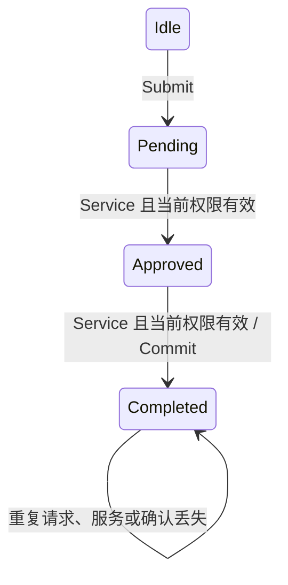

# 运行时接口与轨迹语义：研究记录

日期：2026-09-13。承接用户“继续”和[上一批结果](../README.md)。本批在独立子会话中研究接口，保留上一批理论、ROOT及证据文件原样；正文继续只更新[独立稿](../../../literature/scholar_search_2026-09-10/followup/review_revision_draft_2026-09-13.md)。

## 设计与范围

**同日后续实现：** [SQLite案例](sqlite-runtime/README.md)已对消息来源、事务及进程恢复进行真实执行检查，并逐项匹配本协议的128条转换。它增加经验对应，不改变以下模型假设、证明源文件或既有构建证据。

研究对象是**单个逻辑操作**的最小授权执行协议。状态包含当前权限、建议是否可用，以及四个阶段：未请求、待校验、已校验、已完成，共16种状态。输入为提交请求、可信服务步、权限变更、建议可用性消息、确认丢失和空轮询，展开布尔参数后共8种输入；只有可信服务在提交点重新确认权限后才能产生一次受控效果。重复请求和确认丢失不重置已完成状态。

选择这一模型，是为了让检查/执行间的权限变化、建议依赖和重试行为有明确的反例。只保留抽象迹选择器无法检验这些接口条件；直接接真实外部API会额外引入事务、故障和服务语义，超出本批能够证明的内容。

明确假设：一个服务步中的当前权限检查、效果记录和完成标记在模型中原子发生。这里的“确认丢失”发生在该完成步骤之后；崩溃恢复、跨进程并发、实际服务端幂等性和网络分区尚未建模。权限更新被解释为可信控制面输入；LLM输入限于建议消息。输入来源鉴别和解析器是否实现这个分离仍须验证。研究制品不是部署服务。

## 验收任务

- [x] 定义可执行HOL接口和独立参考状态机；证明每一步在受控投影下模拟参考步骤或保持参考状态。
- [x] 将证明提升到任意有限输入序列；证明参考行为可通过请求/服务步骤实现，并明确与上一批CKA迹模型的连接。
- [x] 在权限不撤销和可信服务步可获得的条件下，证明进展；验证建议失效和确认丢失的行为，给出失效变体反例。
- [x] 实际构建Isabelle会话、检查证明依赖、导出并执行SML；归档命令、日志、哈希和状态；更新独立稿而不修改正文。

预期文件：本目录`ROOT`和`Runtime_Interface.thy`保存语义与证明，`evidence/`保存运行记录和生成代码。构建命令为：

```sh
isabelle build -v -d formal-artefacts/cka-repair -D formal-artefacts/cka-repair/runtime-interface
```

本记录兼作设计、任务和结果入口。沿用既有研究目录组织偏好，避免另建重复计划目录；用户已要求继续这一步研究，不再次要求确认实施方式。不提交或推送。

## 已得到的证明

[Runtime_Interface.thy](Runtime_Interface.thy)在Isabelle2025-2中完整构建成功，返回码0；[依赖审计](evidence/kernel-dependencies.txt)未发现所列定理使用跳过证明或oracle。理论采用标准HOL定义和归纳，不添加目标公理。

| 结果 | 定理/定义 | 严格含义 |
| --- | --- | --- |
| 每步符合参考语义 | `step_simulation` | 投影保留权限更新和提交效果；隐藏输入保持抽象状态 |
| 任意有限执行符合参考机 | `runtime_refinement` | 不是深度受限的迹枚举；输入序列长度任意 |
| 参考行为可实现 | `reference_lifting`、`controlled_language_equality` | 通过插入请求和服务输入实现参考迹，得到受控投影相等 |
| 接到上一批组合语义 | `operational_shuffle_embedding`、`selector_represents_runtime`、`actual_runtime_cka_bound` | 先证明实际协议迹属于参考机与隐藏事件的交错，再把实际协议与选择器连接 |
| 同一操作至多一次提交 | `runtime_at_most_once`、`completed_persists` | 任意有限输入序列，包括重复请求、确认丢失和权限变更；依赖模型中的完成记录不丢失 |
| 有限服务步下的进展 | `service_rank_execution`、`two_service_steps_suffice` | 请求已排队且权限不撤销时，两个可信服务步足以完成；允许期间有任意其他合规输入 |
| 无限输入流上的条件进展 | `eventual_completion_with_service_supply` | 权限始终不撤销，且可信服务步在前缀中的计数无界，则存在完成前缀 |
| 错误协议的反例 | `cached_permission_counterexample`、`retry_counterexample`、`permanent_advice_outage_blocks` | 分别对应过期许可、错误重试和建议依赖造成的进展损失 |



权限和建议可用性是另外两个状态分量。权限无效时服务不提交；建议可用性变化只更新记录，不阻断可信服务。上述“两步”按可信服务调度次数计，不是墙上时钟的时间界。服务供给条件是显式输入流假设，不是本批证明了部署调度器公平。

**一个重要修正：** `[Commit]`是参考语言中的迹，但不直接属于运行时全事件语言，后者必须包含请求和校验步骤。这已经由`plain_planner_trace_requires_bookkeeping`核验。因此上一批的`P⊆G(P∥D)`是偏强的充分条件；本接口采用具体的迹提升证明建立较合适的投影保留性质。

**CKA在这里的实际作用：** 组合记法与选择器提供了统一表述；证明负担主要在状态模拟、迹提升和调度进展。隐藏语言包含协议内部事件和建议事件，并且是过近似，不等于一个已经实现并独立验证的LLM进程。本批没有证明使用CKA比直接状态机推理更省工作，也没有建立完整CKA库实例或新颖性结论。

## 导出代码的实际执行

会话同时通过`export_code ... checking SML`，并导出[生成的SML](evidence/runtime_interface.ML)。[枚举适配器](emit_table.ML)仅构造输入和序列化结果；它不重写状态转换。Poly/ML实际执行生成代码，产生[转换表](evidence/transition_table.csv)，[审计脚本](audit_runtime.py)检查完整有限图及错误变体。

| 执行版本 | 转换行数 | 不符合单步参考关系的行数 | 实际发现 |
| --- | --- | --- | --- |
| `guarded` | 128 | 0 | 没有找到无权限效果或重复效果；建议不可用时两个服务步仍能完成 |
| `cached` | 128 | 2 | 最短4输入反例：请求→校验→撤权→提交，仍产生效果 |
| `advice_blocked` | 128 | 0 | 仍满足该参考包含界，但建议永久不可用时任意多服务步都停在Approved |
| `retry` | 128 | 4 | 最短5输入反例：请求→校验→提交→确认丢失→再次提交，出现重复效果 |

四个版本合计512行。反例长度来自对有限乘积状态图的广度优先搜索；永久阻塞由Isabelle对任意重复次数的引理支持，不依靠只运行若干次后“没看到完成”。详见[执行审计结果](evidence/executable_audit.json)。生成代码、适配器、序列化和Poly/ML运行时仍在执行证据的信任范围内；这不是机器码或真实执行器的正确性证明。

复现命令（先安装同版Isabelle并设置Isabelle和Poly/ML命令路径；从仓库根目录执行）：

```sh
isabelle build -v -d formal-artefacts/cka-repair -D formal-artefacts/cka-repair/runtime-interface
isabelle export -n -d formal-artefacts/cka-repair -d formal-artefacts/cka-repair/runtime-interface -O /tmp/runtime-export -x 'Runtime_Interface.Runtime_Interface:code/**' Runtime_Interface
cp /tmp/runtime-export/Runtime_Interface.Runtime_Interface/code/runtime_interface.ML formal-artefacts/cka-repair/runtime-interface/evidence/
cd formal-artefacts/cka-repair/runtime-interface
poly --script emit_table.ML > evidence/transition_table.csv
python -B -X utf8 audit_runtime.py
```

本机实际命令、版本、源文件及生成物指纹保存在[运行记录](evidence/run_record.json)。先记录了一次未填证明的失败；开发过程中有自动实例化错误和一次180秒自动搜索超时。最终改用显式归纳假设应用，保持目标命题，成功构建；[构建历史](evidence/build_history.json)不将失败或超时记作成功。

## 对论文和下一步研究的判断

本例足以把“还需语义对应”推进为一项具体、可运行、可反驳的证明结果。它仍很小：单操作、布尔许可、明确的可信输入、原子提交、本地完成状态。它没有测量LLM建议对任务质量的收益，不能从“去掉建议依赖后可进展”推断建议本身无价值。

Review正文只宜增加简短说明并链接补充制品，详见独立稿D8；未直接修改正文。最接近的外部先例和引用边界继续使用已有ToolGate、Verified Tool Calls、VeriGuard等阅读记录，本轮没有新增Scholar查询或扩大候选数。

下一步应选择一个有明确事务/执行语义的实际接口，验证下列连接，再考虑扩大案例：

| 尚待落实的连接 | 为什么当前证明没有覆盖 |
| --- | --- |
| 建议输入与可信权限更新的来源隔离 | 当前输入构造器表示已分类输入；未验证认证、解析或传输通道 |
| 当前权限检查、真实效果和完成记录的原子对应 | 一个HOL步骤不能自动消除真实系统的检查/使用竞态 |
| 崩溃恢复和远程结果歧义 | `LostAck`仅为已知完成后的通知丢失；状态丢失和未知远程提交结果不在模型中 |
| 调度和服务供给 | 进展定理以不撤权和服务供给为前提，未验证真实调度器 |
| 多操作/多客户端 | 当前Completed记录只对应一个逻辑操作，不是多请求幂等键实现 |

新增证明与运行记录是本批结果；上一批基础理论、原363条记录、330条筛选、82条比较及原实验数据保持原样。

一致性收尾已通过：[验收记录](evidence/validation.json)确认论文正文、主书目、历史文献JSON和上一批证明源/证据指纹保留；新增证明与执行证据哈希一致，候选引用和本地链接可解析。没有提交或推送。
