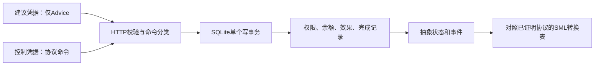

# SQLite运行时案例：事务边界与证明对应

本批承接[已验证协议](../README.md)。案例限定为一个逻辑操作：将固定整数增量计入本地余额；权限、操作标识/增量、余额、效果记录、协议阶段及事件日志全部存于同一SQLite数据库。操作完成后不能复用该数据库处理另一操作。数据库外的API调用不在事务内。

设计判断：先验证真实实现与已有证明之间的连接。再加一个把“事务原子”写成假设的定理，并不能证明Python或SQLite正确，因此本批采用既有Isabelle导出表作为独立转换预言机，加上真实HTTP、并发进程和崩溃恢复实验。不把测试结果标为端到端形式化证明。

## 设计与验收计划

- [x] 输入隔离：回环HTTP服务根据服务端保存的两个不同凭据区分建议/控制来源；消息中的role或命令字符串不能提升权限。建议只允许Advice；控制端处理协议命令。严格检查JSON字段和类型。
- [x] 事务实现：使用显式BEGIN IMMEDIATE；在同一事务内读取当前权限、产生余额效果、记录完成和事件。所有权限更新使用同一写事务机制；初始化不重置已有状态。
- [x] 对应检查：对既有SML生成表中的128个guarded转换，逐项比较真实SQLite操作后的抽象状态和事件，同时检查余额/完成记录一致性。
- [x] 故障实验：独立进程在事务前、读权限后、效果写入后、完成记录后及提交后直接退出；重启检查恢复和重试。加入多个进程的提交竞争及受控撤权交错。
- [x] 反例与归档：三个独立变体分别移除来源限制、提交点权限检查、效果/完成的共同事务；确认测试检测到具体失败，记录命令、版本、哈希、日志和来源。

实现使用Python标准库，不安装依赖，不发布服务；测试结束关闭回环监听。凭据在本地测试中随机生成，不写入证据文件。本文兼作计划和结果入口，正文修改继续放入独立稿。

## 实际结果（2026-09-13）

Python 3.11.9、SQLite 3.45.1、Windows；[核验脚本](verify.py)返回0，9组测试全部通过。三种变体各自返回1，由预期的行为断言失败识别，未把导入失败或运行错误算作检测成功。详见[运行记录](evidence/run_record.json)、[测试结果](evidence/tests.json)和[完整日志](evidence/tests.txt)。

| 连接/性质 | 实际检查 | 观察结果 |
| --- | --- | --- |
| 接口到模型 | 用真实数据库执行16种抽象状态×8种输入，对照既有SML导出表 | 128项状态/事件均一致，同时检查余额、效果记录和完成阶段一致性 |
| 输入来源 | 真实回环HTTP请求，未知凭据、建议凭据越权、role字段注入、合法建议/控制命令 | 未知凭据401；4类越权403；role注入400；合法请求200；拒绝请求不改变数据库 |
| 解析边界 | 重复JSON键、错误布尔类型、非法整数/操作名、额外故障注入字段及非法编码等9个请求 | 全部400，数据库不变 |
| 当前许可 | Submit→Service→撤权→Service | 不产生效果；重新授予权限后可完成 |
| 建议失效、重复和重启 | Advice false、LostAck、同操作重提、重复服务、再次initialize | 最终余额7，只有一条效果记录；初始化不清空完成状态 |
| 操作绑定 | 同标识不同增量、不同标识重提 | 拒绝且状态不变；本数据库始终只对应一个逻辑操作 |
| 进程竞争 | 两个独立进程都就绪后释放执行，竞争同一Approved操作 | 都正常返回，最终一条效果记录、余额7 |
| 撤权交错 | 服务取得写事务并读权限后暂停，让另一连接尝试撤权 | 释放服务后，日志顺序为Commit、Policy false；另一个测试覆盖撤权先完成 |

余额是本案例数据库里的整数，不连接支付系统。每个模型表测试固定绑定`op-1`及增量7，并用内部夹具构造合法状态；128项穷尽的是这个有限抽象转换空间，不是所有HTTP输入、所有SQL数据库状态或任意数据载荷。

### 崩溃恢复

子进程在下列检查点调用`os._exit(73)`，不运行Python的finally、关闭连接或回滚清理；另一个新进程打开数据库观察恢复，再由新进程重试。这里测试应用进程突然终止，不模拟操作系统断电、磁盘故障或SQLite内部提交指令的每个位置。

| 退出位置 | 新进程观察到的阶段 | 余额 | 重试后余额 |
| --- | --- | --- | --- |
| BEGIN前 | Approved | 0 | 7 |
| 事务内读权限后 | Approved | 0 | 7 |
| 效果/余额写入后 | Approved | 0 | 7 |
| 完成阶段及事件写入后、COMMIT前 | Approved | 0 | 7 |
| COMMIT后、返回确认前 | Completed | 7 | 7 |

数据库设置实际读回为`journal_mode=delete`、`synchronous=3 (EXTRA)`、`busy_timeout=3000`。当前权限检查在`BEGIN IMMEDIATE`取得写事务后发生；效果、余额、阶段和日志共同提交。SQLite对写事务进行串行化，这是本实现选择这一边界的依据；锁等待可能失败，不产生服务供给保证。[SQLite事务文档](https://sqlite.org/lang_transaction.html)

回滚日志恢复和同步设置提供数据库层的条件性依据，仍依赖正确的文件系统、锁和存储行为。测试没有证明SQLite本身，也没有做断电耐久性实验。[原子提交说明](https://sqlite.org/atomiccommit.html)、[同步设置](https://sqlite.org/pragma.html#pragma_synchronous)

### 三个反例对照

| 单独引入的错误 | 失败见证 | 原始证据 |
| --- | --- | --- |
| 去掉建议端权限限制 | 建议凭据调用SetPermission成功，HTTP 200而非403 | [日志](evidence/mutant-authority_bypass.txt) |
| 提交只依赖Approved，不再检查当前许可 | 已撤权仍输出Commit | [日志](evidence/mutant-cached_permission.txt) |
| 效果先单独COMMIT，随后另开事务写完成状态 | after_effect/after_state退出后，余额7且阶段Approved | [恢复观察](evidence/mutant-split_transaction.json)、[失败日志](evidence/mutant-split_transaction.txt) |

第三个变体即使保留效果表主键，也已经违反“效果与完成状态一致”。主键可能阻止下一次重复插入，却不能使半完成状态自动等同于模型中的Completed，更不能保证可恢复的进展。变体只在临时副本中运行；精确替换和源文件哈希保存在运行记录。

## 怎样与已有证明衔接



抽象映射保留`permitted`、`stage`及`advice`，用效果成功提交表示Commit，用权限事务表示Policy，其余协议输入为Hidden。拒绝的请求不纳入已接受命令迹；有效Submit限于当前绑定操作。恢复后，在已测试检查点观察到原状态或完整下一状态。这个对应有运行证据，**没有Python/SQL实现精化的机器证明**。

已有Isabelle定理对任意有限协议输入序列成立；本批没有修改该理论，也没有重跑或宣称新增Isabelle证明。CKA迹包含仍依赖那项已证明的语义连接；身份分类和事务实现不会由CKA自动保证。运行阶段执行请求校验和事务，设计阶段的证明指导这些检查。这里没有逐请求调用Isabelle内核，也没有在线证书机制。

HTTP边界假定控制凭据保密、调用方不能直接读写执行器内存/数据库。它实现消息层的来源分离，没有搭建操作系统沙箱；拥有同用户文件访问权的恶意LLM进程不在该边界内。使用的标准库HTTP服务只作回环实验，其官方定位也不适合直接部署为生产服务。[Python HTTP文档](https://docs.python.org/3.11/library/http.server.html)

## 复现与资料位置

从仓库根目录运行：

```sh
python -B -X utf8 formal-artefacts/cka-repair/runtime-interface/sqlite-runtime/verify.py
```

脚本创建临时数据库和回环服务，运行正常测试与三个隔离变体，然后关闭服务并保存证据。它读取上一批已归档的SML转换表；模型理论和导出表的哈希进入新记录，因此不用重新转录状态机作为测试预期。重新生成该表的方法见[上一批README](../README.md)。

- [ledger.py](ledger.py)：可信执行器与事务；[ingress.py](ingress.py)：凭据和输入边界。
- [test_runtime.py](test_runtime.py)、[crash_worker.py](crash_worker.py)：真实接口/进程测试与退出注入。
- [来源核对](evidence/source_checks.json)：5项官方技术资料的定向读取，不是新增Scholar文献筛选。
- [初始失败](evidence/red-test.txt)、[第一次完整运行](evidence/test-run-01.txt)：初始未实现；随后一次完整运行在测试夹具清理时失败。原因是sqlite3连接上下文管理器不负责关闭连接，已用显式closing修正；没有改动协议来回避失败。[Python连接文档](https://docs.python.org/3.11/library/sqlite3.html#how-to-use-the-connection-context-manager)

## 对论文的独立判断

这一批补上了一个可复现的实现案例，支持“从证明义务检查运行时边界”的研究路线。它的规模和工程手段仍不足以宣称新框架、通用运行时形式化保障或CKA相对直接状态机证明的优势。

建议把当前三批研究暂时收束：review修订优先审阅D1–D5，案例与证明放入补充材料；独立稿D9仅用短段解释新增实现证据。下一项有价值的研究应是针对一个明确迁移目标，比较直接状态机推理与CKA组合推理所需的义务和复用范围。继续堆叠同类微型案例不会回答这个问题。远程服务、多操作、调度公平、LLM建议质量及完整旧Bridge证明仍属未完成研究，不列为本批交付。

正文、主书目和历史文献集合保持不变；没有提交或推送。最终一致性检查见[验收记录](evidence/validation.json)。
