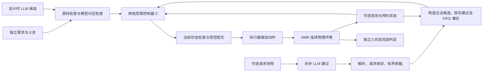

# AMR 主案例重设计：从局部检查到可执行的组合保证

2026-09-21。状态：**研究设计，不是已完成实验或证明**。用户要求根据文章内容与需要重新设计案例。本文件取代继续扩充同类生成采样的优先级，不改写既有协议、失败记录或成功结果。本轮不实现新控制器、不运行新模型采样、不修改正文结论为已证。

依据为当前 `main.tex` 实际载入的引言、Generate and Check、Runtime Enforcement、Assurance、bridge、Research Agenda 和 Conclusion，以及[研究范围 S1–S8](research_scope_2026-09-15.md)与[综合论证](research_synthesis_2026-09-15.md)。[独立整合稿](review_integration_2026-09-15.md)是后续文字收敛入口；它与活跃 TeX 的完成状态分别记录。已有 CKA 结果只按其实际语义复用。

## 1. 案例应承担的任务

正文的核心结论是：局部验证结果需要规格有效性、跨表示语义联系及组合依据，才能支持系统保障论证（`sections/16-conclusion.tex`）。本案例只检验其中一条具体证据链，不承担对六类文献的普遍实证验证。

**主问题：同一份经过局部检查的生成控制器，经过模型提取、状态解释和建议/执行接口之后，什么条件才能使其检查结果仍然适用于实际发生的控制事件？**

| 案例主张 | 正文依据 | 必须交付的证据 | 不作出的主张 |
| --- | --- | --- | --- |
| C1 接受标准需要独立、稳定且明确覆盖所宣称的需求 | §Generate and Check；研究议程 RQ1；S2 | 独立需求表、正确/弱化规格对照；保留原 v1 缺少到站制动的失败见证 | 规格因人工认可就必然完整；模型修复时可降低目标 |
| C2 模型上的结论要通过具体对应才能用于源码及其动作 | 研究议程 RQ2；S3、K3/K5 | 原始源码与提取模型的逐输入对应；错误提取反例；布尔事实到实际物理事件的单独验证 | 模型通过即源码正确；模式对应即物理安全 |
| C3 合法建议可以改变选择，但不能绕过当前授权；安全包含与进展分别验证 | §Runtime；研究议程 RQ4；S6/S7 | 有影响的 A/B 建议对照、陈旧状态提交反例、建议失联停滞反例、条件组合与进展定理 | 固定建议流保留所有参考次序；安全包含推出完成；CKA 自动解决物理风险 |
| C4 系统论证需保留上述连接、假设及其版本 | §Assurance；review 问题 3 | 一张主张—证据—假设表，明确已检查、已证明、假设和未决项 | 新 assurance 平台优越性、维护效率或专家评审效果 |

S3→S6→S7 是主线，C1/C4 分别固定入口和输出。成功标准是建立或反驳这些具体联系，不是最大化模型通过率。

## 2. 场景选择与范围

比较三种方向后，选择**保留现有厂区双 AMR 物理环境，重做建议与执行接口，并加入针对语义连接的对照**。

- 扩大现有生成样本：成本小，但主要增加同任务生成可行性证据，不能补 CKA/运行时组合义务。
- 全面转向自动驾驶或高自由度具身规划：工业性更强，但感知、动力学及任务规划会显著扩大可信基础；与目前无硬件、采用可复现仿真的条件不匹配。
- 双 AMR 的窄通道预约、整车释放、保护停车和恢复：复用已检查的环境，新增复杂度直接服务于 C2/C3，作为主设计。

两台运输备件的 AMR 从通道两端请求通行，共享单车可占用的控制区 Z；中间存在行人横穿带。调度建议影响下一台获准通行的机器人，安全执行涉及预约所有权、最新有效观测、保护状态、整车清空、制动和停稳。只研究每台一个待完成任务，任务集合有限且不动态追加；无限任务到达下的公平性另行研究。

保留尺寸、地图、路线、有限加减速、观测/执行延迟及独立几何 oracle。新增版本另建目录，历史仿真和配置不原地修改。关键场景由状态条件触发，例如“校验完成但尚未施加动作”“车中心越过 Z 边界但尾部仍占用”，避免继续用固定第 10 秒作为所有物理论证的触发点。

## 3. 独立需求与两种 LLM 角色

先固定新的需求包 `amr-advisory-contract/v2`，与旧 v1.1 分开。由研究者写出需求、形式义务、可观察违例及环境假设，模型不能修订接受目标。

| 需求 | 精确定义要点 |
| --- | --- |
| R-S 安全授权 | 受控动作只能经可信执行接口产生；提交/施加时核对当前任务、预约、控制相关版本及动作前提。建议内容不能签发预约、覆盖保护停车或直接写执行器。 |
| R-G 物理事实解释 | 释放预约所用 Clear 必须对应整车轮廓清空 Z；Halted 与发出 Brake 分开；Resume 不等于已经施加 Proceed。涉及误差/延迟的保守性作为单独义务。 |
| R-F 建议响应 | 在规定的选择锁存点，两台均为当前合法候选时，若邮箱已有当前任务有效、唯一的 A/B 建议，应选建议对象；只有一台合法时只能选该台。无有效建议时按固定 FIFO 规则选合法候选。锁存后到达的回复不改变本次选择。此项是功能性要求，不能覆盖 R-S。 |
| R-P 条件进展 | 必做模型目标：存在有效待处理请求、owner 空闲且授权前提持续成立时，可信服务得到调度就应最终产生合法 Grant，不要求 LLM 应答。两车完整运输完成另作闭环实例评价；只有建立局部 plant 进展契约后，才升级为完成定理。永久物理阻挡时只要求满足停车/占用约束。 |

**设计时 LLM**生成 `select/step` 受限监督器候选；源语义、模型语义、分支优先级及接受域明确固定。沿用现有有限布尔接口时，新增 R-F 可在相同输入域中检查；若必须扩展词汇，另行记录新域大小，不能自动沿用 1,824 这个数字。

**运行时 LLM**只产生“建议下一台选择 A 或 B”的数据。请求由可信侧分配请求标识并保存任务/控制快照；模型回复不自行声明有效凭证。可信侧把返回值与保存的请求记录绑定、严格解析并存入有界邮箱；调用在控制线程之外执行。过期、重复、无效或缺失回复均不能阻塞可信控制周期。

R-F 使建议确实能改变系统行为，避免把“永远忽略建议”当作成功。它不把建议赋予超越安全规则的权限。自然语言建议质量与接口的组合正确性分别报告；本案例不承诺全面评估自然语言理解。

旧实验明确允许忽略偏好，故旧五份源码在旧规格下仍然合格。它们进入新阶段时必须全部按 v2 重新验收并公布通过/失败，不能只挑先前会选 B 的那份而隐去其他结果，也不能追记旧候选为需求违反。若没有候选满足新义务，再开展有限的新生成试验。

## 4. 操作接口与真正的执行点

可信适配器只提供当前合法候选集合、锁存的有效建议（或无建议）及可信登记顺序；**最终 A/B/Wait 必须由原始 C.select 返回**。FIFO 是 C.select 应实现、由独立 R-F 判据检查的功能，不是外围先选好 A/B 再把它伪装成源码决定。事实到受限输入词汇的映射在阶段 A 冻结；若旧词汇不能表达 FIFO 次序，明确记录接口迁移并重新验收，不能把改写后的源码当成旧字节复测。违反 R-F 时记录源码失败，即使权限 guard 拦截后保持安全也不能改记合格。需要记录源码原始决定、guard 判定、实际提交及实际施加四个层次。

提议的逻辑过程是：取得快照→形成候选动作→可信接口在提交点重新检查→记录/签发受控命令→执行器在施加点检查命令有效性。**把检查与队列入队原子化，不等于已经消除了入队到施加之间的变化。** 证明中必须明确令牌撤销与施加的顺序语义，并分别检查提交和施加；若底层做不到相应时序，就收窄结论或保留这一未决义务。

需要区分两类版本，避免把所有上下文变化都混成“陈旧建议”：

- **任务建议绑定**：可信请求标识、任务集合/需求版本、机器人及任务身份。建议只表达任务排序，不签发任何安全许可。任务不变时，较早返回的排序可以保留；区域占用变化不自动使排序失效，但采用建议时必须重新计算当前合法候选。
- **动作许可绑定**：一次选择/校验的 decision_id、当前区域/策略状态版本、预约代次、当前观测及源码/规格/适配器身份。校验后相关状态变化必须使旧动作重新核验或失效；即便任务建议仍有效，也不能复用旧动作许可。

普通时钟推进或内容不变的观测刷新不应无条件更换任务建议版本，否则慢建议必然全部失效。建议有效性也不能替代传感新鲜度。这样，排队期间提前取得的任务排序可以在下一次合法调度时发挥作用，同时 E3 仍严格检验陈旧动作许可。

首版邮箱采用确定规则：每个任务上下文至多一个已登记建议请求，可信侧保存身份；首个符合格式及绑定的 A/B 回复填入一个槽位，重复包与后续回复只记录、不覆盖，任务上下文变更则清空。无有效回复时槽位为空。任务上下文包含实际用于排序的任务信息版本，不能只看 mission_id；首版仅检验 A/B 响应性，不证明排序理由始终符合业务事实。不会通过等待更多回复来“消除歧义”。

选择锁存点定义为可信服务处理一次可决策请求的开始；**为本次选择等待 LLM 的预算为零**。服务使用此刻已在邮箱的有效建议，或立即使用 FIFO。锁存前到达且经解析的回复可参与，本次锁存之后到达的回复只可能供后续决策使用。必须在模型中规定同一时刻事件的顺序。候选通过 Validate 后冻结，不因更新的建议反复撤销/重启；只因真实许可前提变化而失效。这样可以直接检验建议洪泛或迟到不使进展的秩不断归零。

新的观测帧编号本身不撤销提议。提交时以当前新鲜观测重新评价动作前提；若同一动作仍适用，可完成本次提交，不必从头锁存。只有任务撤销、预约易主、保护状态改变等使权限前提失效的变化才触发失效或重新决策。进展前提是相应阶段的动作持续可用，不是所有传感值和状态字节永远不变。

两车每车只有一个任务，真正能改变先后次序的选择通常只有一次。因此实际建议试验应在**任务已经登记、车辆仍在接近等待位**时请求建议，待双方到达预定等待位、形成双请求后按正常服务调度锁存。接近路线、初态和服务规则必须在调用前冻结；物理时钟持续运行，不因 API 慢而延长窗口。若无法获得双请求且回复及时的窗口，真实样本只报告接口兼容性；A/B 影响性仍由明确标记的脚本正对照支持，不能称实时建议效用。

如果真实服务总在有用窗口结束后才返回，必须报告建议未被采用及其机会窗口；不能通过暂停物理时钟等待回复而制造实用性证据。有效 A/B 的构造正对照仅证明机制允许有用影响。

当前实现的 50 ms 监测周期、100 ms 命令延迟是参考参数，不能据此宣称某个新原子操作或最坏反应时间已实现。新的执行接口适配是拟实施内容。

## 5. 四个核心对照与两个边界校准

各对照一次只改变一个连接。所有“预期”均为待验证预测；若前提不满足或对照没有产生预期区别，必须报告并修订论断，不能后换成功判据。

| 编号 | 固定对象与唯一变化 | 前端可能仍显示通过的原因 | 独立判据与预期区别 | 支撑主张 |
| --- | --- | --- | --- | --- |
| E1 源码—模型错配 | 同一源码，正确提取与故障提取对照；故障模型在合法双请求/B 建议输入上报告 B，而源码实际返回 A | 源与模型各自均可满足旧安全约束；若只检查故障模型的 R-F，也可能报告功能通过 | 完整源/模型输出对应发现差异；v2 源功能检查也应拒绝；报告各门分别捕获什么，不宣称对应门唯一必要 | C2 |
| E2 物理谓词错配 | 同一已检查控制器；Clear 的实现从整车清空改为中心点清空，其余不变 | 控制器和模型都正确使用同一个 Clear 布尔值，局部策略与对应可以全通过 | oracle 在释放时独立检查实际轮廓仍占用 Z；正确解释不得提前释放。提前释放即违例，不强求一定撞车 | C2、C4 |
| E3 校验—施加错配 | 同一控制器/建议；在校验后、施加前使许可相关状态变化。比较缓存许可与当前版本/状态绑定 | 候选在原快照确实合法，局部证明并未承诺快照始终有效 | 记录当前不允许时施加 Proceed/签发失效预约的事件；正确接口拒绝陈旧动作。此测试安排机器人尚未进入控制区，避免把已无法避免的物理停车过程误当授权错误 | C3 |
| E4 建议依赖导致停滞 | 同一候选、道路持续开放、两车可服务；将接口改为等待建议后才调用/提交控制器，与无需建议的 FIFO 回退对照 | 控制器对所有输入仍正确，未被调用时不会产生局部违规；空/受限控制迹仍可能满足安全包含 | 坏版本存在持续服务但永不授权的模型执行；正确版本在明确供给条件下最终授权，运输完成另由闭环评价。有限仿真超时是观察，永久停滞需要循环见证/定理 | C3 |
| B1 规格充分性校准 | 复用已归档的 v1 到站制动遗漏，与 v1.1 对照 | 原规格不包含必要的到站制动义务 | 手工候选在规格开发中实际暴露到站制动缺口，补齐规格后重验；不是预埋故障或真实 LLM 错误率 | C1 |
| B2 环境不满足校准 | 正确组合下临时与永久行人阻挡 | 安全成立并不代表完成前提成立 | 临时阻挡消失后恢复；永久阻挡安全等待。与 E4 的道路始终可服务严格区分 | C3、C4 |

E1 的故障转换是明示的构造缺陷，不冒充真实提取器天然错误。它应先在有限表上确认“被比较的局部性质确实通过”，再作为可观察反例进入报告。不能先看结果，再把某个失败的弱基线标成通过。

E1 只能支持“模型局部通过仍可能与源码不符”；由于源码 R-F 也会拒绝，它不证明完整 v2 流水线错误接受，也不证明对应检查相对源码穷举功能检查有额外检测收益。E2 必须实际评价 Clear 的几何解释，不能只让文件哈希变化触发拒绝就称发现了物理语义错误。

E3 分成两个最小子见证，分别只移除对应间隙的检查：

- **E3a**：Validate → 许可撤销 → CommitGrant。检验预约检查与提交的原子性。
- **E3b**：合法 Commit/IssueProceed → 许可撤销 → ApplyProceed。检验入队后的撤销，不能让 E3a 的提前拒绝遮蔽施加缺陷。

首版仿真中的 Apply 与可信状态更新在同一事件调度器中排序；Apply 查询当时的保护状态、owner 和命令代次后才产生效果。它不是只携带旧 epoch 就能自行发现撤销的分布式执行器。若扩展到远程执行器，必须另建当前状态传播或撤销屏障及反应界；本案不声称远程零延迟撤销。

配对版本使用相同初态、外生扰动与服务供给规则；运动后的观测由各自 plant 生成，不能强行复用另一条已不同轨迹的位置观测。E2/E3 可以从同一前缀快照分叉。

另设**建议确有影响的正对照**：同一初态和其他输入，仅改变有效建议 A/B，最终获准次序应随之改变且均合法；再以无建议对照验证 FIFO。它检验接口功能，不证明哪种建议更优。

不进行所有因素的笛卡尔积。E1 以有限语义检查为主；E2/E3/E4 各比较明确的坏/好接口；B1 复用历史证据，B2 保留少量物理边界运行。首先获得可解释的最小见证，再选择有代表性的物理轨迹。

## 6. CKA 的具体角色与证明目标

采用仓库已经核验的有限交错迹语义作为起点：[Bridge_Trace_Repair.thy](../../../formal-artefacts/cka-repair/Bridge_Trace_Repair.thy)。它提供 `authority_boundary_traces`，但不是已经完成的整个 CKA 库实例。[单操作接口](../../../formal-artefacts/cka-repair/runtime-interface/README.md)提供模拟与迹连接的方法，不自动覆盖 AMR。

### 6.1 先定义操作系统，再定义语言

安全参考系统 P_ref 独立由 v2 的安全需求及可信环境接口定义；双方都合法时允许 A 或 B。建议响应函数 F 另行规定 R-F 的选择，不把具体建议流固化到 P_ref 的允许行为里。

**S_HOL 是有类型的离散协议模型，S_Python 是执行原始生成源码的仿真实现。** 两者分别包含候选意图、建议、解析/绑定、预约管理、提交及施加层，但不能因结构相似就当成同一系统。O2/O3 的任意有限迹定理首先只针对 S_HOL；O5 的有限转移对照不能自动升级为任意 Python 执行的精化证明。先给出状态和转移，不用任意“安全迹集合”冒充可执行 guard。投影包含负责权限界；F 的满足在保留建议与锁存事件的全迹上另查，不能从隐藏了建议的投影自动推出。

HOL 安全边界可以允许候选输出任意类型正确的意图，由当前状态 guard 限制实际效果；该定理本身不证明候选有用。R-F 与进展另需候选总定义、选择响应及必要动作义务。首版通过冻结有限决策表在 HOL 内检查这些局部性质，并将表项与原始源码、提取模型及输入编码逐项对应。表的导入与 Python 解释器之间仍是有明确域的跨工具证据；不得把“C 实现 F”写进假设后就称原始源码已经得到 HOL 证明。

可见字母表 V 保留 Grant、受控动作施加、Release、StopConfirmed、Complete，以及解释这些许可所需的可信环境/策略更新。建议请求、建议回复及纯内部记账可以隐藏。**不能把区域关闭、任务撤销等更新删去，然后在仍允许的旧环境里解释后续动作。** 物理事件如何映射为抽象事件另列对应条件。

D 的投影静默指它不能自行产生 V 中的受控/可信事件；不表示它不能改变受信流程对合法分支的选择。共享状态与通信先由 AMR 操作语义说明，不能仅写 P∥D 就声称交错语义已经实现了同步。

### 6.2 本案选择的组件分解

采用 **P_open＋D＋因果协议 T** 的分解：P_open 是可信协议的开放语义，保留 Service、Validate、建议消费和内部记账等事件；D 只产生建议提供者事件；T 用预先给出的状态转移约束请求、回复、消费和锁存之间的匹配顺序。每个事件构造器必须有唯一来源和可见性，可信内部事件不能塞进“LLM 语言”。

P_open 在建议消费处允许任意类型正确的数据，因此可以独立检查当前授权不变量；建议功能与候选表的义务另列。先证明其单步模拟及 `π_V(T(P_open)) ⊆ T(P_ref)`。T 的前缀语言 K_T 只能由邮箱、身份及调度转移定义，不能定义为“所有投影安全的迹”。令 `G_T(X) = X ∩ K_T`，证明 S_HOL 的运行可以分解为 P_open 与 D 的交错并满足 T；这是 O3 的操作连接，不能作为未经证明的前提。

由这些义务复用现有迹定理，拟得到：

\[
\pi_V(\mathcal T(S_{\mathrm{HOL}}[D]))
\subseteq \pi_V(G_T(\mathcal T(P_{\mathrm{open}})\parallel\mathcal T(D)))
\subseteq \pi_V(\mathcal T(P_{\mathrm{open}}))
\subseteq \mathcal T(P_{\mathrm{ref}}).
\]

这里有意义的复用单位是：在 P_open、T 与接口不变时，允许更换任意满足静默与输入约束的建议提供者，包括不回复者，而不重新证明可信协议的安全不变量。它不预设证明更短或优于直接状态机。真实模型只是一种提供者；A/B、缺失及迟到脚本是机制见证。

若此分解不能完成，只能退回已记录的较弱结果：先证整体操作模拟，再用全部隐藏事件的 H_all 过近似形成迹推论；必须称为结果的组合表述，不能把 H_all 称为真实 LLM，也不能把该退路报告成上述组件替换结论已经完成。

### 6.3 必须分开交付的义务

| 义务 | 拟证明/检查内容 | 本阶段地位 |
| --- | --- | --- |
| O1 原始候选对应 | 受限源码与模型在固定完整输入域上的结果相同；绑定实际源码、规格和提取器版本 | 复用并扩展现有逐候选 translation validation；不是整个解析器已被证明 |
| O2 单步操作模拟 | P_open 每一步的可见事件被独立 P_ref 允许，并保持抽象状态关系；隐藏步骤不非法改写受控状态 | 新 HOL 操作模型的核心证明任务 |
| O3 组合解释 | 证明 S_HOL 与 P_open/D 事件交错及因果 T 的联系，以及 D 静默和 G_T 收缩；在明确实例上复用 `authority_boundary_traces` | 新 AMR 实例化任务，不把组合包含结论作为假设 |
| O4 条件授权进展 | 对任何允许建议流，含永不返回的流，在 R-P 的稳定授权与服务供给前提下最终 Grant；候选表的总定义与 R-F 单独检查 | 必做离散模型定理，独立于安全包含；完整运输完成证明为可选加强 |
| O5 实现与物理连接 | Python 协议与 HOL 转移的有限对照；应用事件与日志/源码身份对应；Clear/Halted/制动域与物理 oracle 对照 | 明确报告经验/有限对应与尚未证明的连续物理精化 |

目标的简写是：在明确的接口和环境假设下，

\[
\pi_V(\mathcal T(S_{\mathrm{HOL}}))\subseteq\mathcal T(P_{\mathrm{ref}}).
\]

经 O2/O3 建立操作联系后，才可以把它写成已经核验的组合结论。若通过 O2 先证明了同一个包含，再把 S 定义成过滤器与语言求交得到 CKA 推论，必须如实称为**已有语义结果的组合表述与定理复用**，不能声称 CKA 独立消除了证明负担。已有单操作协议采用这种路径，不能在新稿里夸大它的贡献。

本设计不要求固定建议流使投影等于所有参考行为；否则 A/B 建议无法真正筛选次序。完成能力与在明确调度前提下的必然进展分别表达。还需构造去掉关键前提后的见证：D 可直接发控制事件时权限界失败；只保留安全包含时 E4 仍可停滞。

如果无法建立 O2/O3，AMR 只能被报告为组合问题的经验见证，CKA 继续是研究议程，不能进入“已验证方法”的结论。

### 6.4 进展前提不能隐藏问题

**最低 O4 固定为离散授权进展**：有效请求存在、owner 空闲且当前动作前提成立后，在可信 Service 持续供给下最终 Grant。稳定性条件限定在该 Grant 发生之前：若尚未授权，环境更新继续允许相应授权；Grant 自身取得 owner 后当然不必继续满足 owner 空闲。它不直接推出排在占用者后面的请求或两个运输任务最终完成；先行者的释放和到站是另外的连接。请求、Validate、Commit 阶段的秩须在普通建议和仍支持相同动作的新鲜观测下不增加，在规定服务步下降。

完整任务完成是可选加强，限于有限任务集合。所需前提分别说明：任务持续有效；道路最终持续允许通行；观测与执行服务最终恢复；可信提交服务持续得到机会。不能将“获得许可的车辆最终清空并完成”作为假设，再宣称证明两车完成。

物理供给应分解为局部契约：执行器在有界延迟内施加仍有效的命令；持续 Proceed 时，非终点直线段的剩余路程在统一有限步数内减少至少统一正量，或跨越该段终点阈值；有限路线拐点的转向在有限步内结束；Brake 在给定界内产生真实停稳及相应确认。正量和各步数界须对所声明阶段域统一有效，并从选定 plant 的参数和转移推导/核验，再结合有限路线、预约次序和任务数构造进展秩。不能以每一步的递减量都大于零排除无限逼近。若这些局部契约不能建立，只报告离散协议的条件授权进展，并把完整任务完成限制为所执行的仿真结果，不能补一个含有结论的假设。

不假设 LLM 最终返回、建议总正确或网络永不丢包。对 E4 必须在坏/好版本中保持同一环境和服务输入；不能把“成功完成”换一种说法塞进好版本的公平性假设。

## 7. 物理证据的重新设计

原“第 10 秒触发行人”往往发生在汇入转向段，不能支撑直线停车公式。新制动校准在车辆确实位于所声明直线接近域、以已记录速度接近横穿带时触发，并记录车体前缘距离、朝向、观测年龄、延迟上限及制动假设。

至少保留：满足充分停车条件的场景，以及刚超出该条件的边界场景。条件不满足只表示现有保证不适用，不预言一定碰撞。若进行连续几何重放，要分别报告前提成立、是否违规、碰撞/未决及距离界，不能用“没有撞到”倒推前提成立。

E2 的中心点/整车对照优先使用进入可复核占用区间的状态触发。参照轮廓来自独立 oracle，不复用待检 Clear 实现。所有故障变体均在仿真中执行、明显标识；没有真实机器人或工业符合性声明。

## 8. 模型样本与机制实验分开

现有 6 次真实初始请求和历史修复链保留，作为受限生成可行性及失败记录。先按 v2 重验全部原始源，不把旧通过率平移为新通过率。

核心 E1–E4 先用明确标识的构造变体和建议脚本完成，保证能定位具体机制。不得把这些构造错误计入 LLM 错误率，也不等待模型偶然产生某个所需错误。

运行时接口冻结后，才考虑一批小规模真实建议输出，例如三种任务表述各两次、共六份，记录全部输出与拒绝/回退。它们用于验证真实服务输出能够进入相同接口，不为跨任务成功率或优化收益提供统计证据。若重放真实输出，内容及交付延迟分别标识：预设仿真延迟不是实测 API 响应时间，暂停仿真等模型返回也不是实时控制实验。

实施时按明确批次冻结次数、输出限制、超时和停止条件；没有因为模型输出不好而自动更换规格的路径。

## 9. 评价与可否证标准

主要报告一张**义务覆盖矩阵**：每个候选/故障版本对源码局部性质、模型局部性质、源模型对应、当前状态授权、物理解释、建议响应及进展分别是什么状态。状态区分通过、失败、不适用、未检查、假设，而非压成单个绿色分数。

次要量包括：首次失配的最小输入/迹；原始与实际施加动作；过早释放及非法施加次数；拒绝/回退原因；完成时间；模型检查状态空间/边界；证明依赖；模型调用与人工修改记录。不同 checker 配置只按其实际义务比较，不以工具数量推导优势。

可否证点：

1. 若 E1 的“模型通过”前提不成立，该构造不能用于支持源模型连接缺失的假接受论断。
2. 若有效 A/B 建议无法改变任何合法控制次序，就没有体现有用的 advisory 角色。
3. 若正确协议在道路可服务、可信服务有供给且建议永久失联时仍可永久等待，R-P 失败，不能以安全为由记为通过。
4. 若坏/好提交接口在精确事件排序下没有可观察差异，就没有证明该绑定机制在本案中必要。
5. 若 AMR 的操作语义不能满足所引用迹定理的前提，就不能把图中的并行框或公式写成 CKA 结果。
6. 若只有几何重放通过、物理抽象关系仍未建立，应保留有界物理证据和开放义务，不补写普遍安全定理。

## 10. 实施顺序与停止点

| 阶段 | 完成物 | 进入下一阶段的条件 |
| --- | --- | --- |
| A 固定需求与最小见证 | v2 需求/义务表、E1–E4 确切输入与最短操作轨迹、参考系统状态与事件词汇 | 每个对照确实区分一个义务；需求不依赖观测到的模型结果 |
| B 建立离散组合联系 | AMR HOL 协议、O2/O3 与最低 O4（条件授权进展），关键假设撤除后的反例 | 实际成功构建、依赖检查和对应目标齐全；不以 admitted 步骤补缺口；完整物理完成定理不作为进入 C/D 的门槛 |
| C 接回实际控制与物理世界 | v2 逐源重验、协议转移对照、E2/E3 状态触发的物理轨迹、停车域校准 | 源码、模型、操作事件、执行器事件均可追溯；物理假设单列 |
| D 少量真实建议与全文整合 | 所有真实回复和重放记录、覆盖矩阵、主文案例与补充材料 | 四项主张均有相应证据或明确收窄，结论与实际完成状态一致 |

阶段 A 是低成本设计检验；若不能形成有效最小见证，就先修改设计，不直接进入更多采样。B/C 可以在稳定接口上局部并行，但不能用 C 的仿真成功替代 B 的组合证明。只有本文确实需要更强的实现/物理保证时，才升级到完整代码精化或连续系统证明。

## 11. 如何进入正文

活跃正文尚未整合这批 AMR 结果。后续在唯一独立稿入口收敛，再应用到 TeX，不建立第二份竞争正文。

- 引言贡献：把“bridge 小例子”更新为“一个工业语境下可复核的证据连接案例”，具体措辞须等 A–D 的实际结果。
- Generate and Check：引用 B1/E1，区分规格充分性与源码/模型对应。
- Runtime：用 E3/E4 和有效 A/B 正对照解释建议权限、当前状态和进展；在此呈现经证明的组合条件及 CKA 的实际角色。
- 主案例节：按“需求与对象→局部结果为何不够→补充连接→实验/证明与剩余义务”叙述。正文只保留架构图、覆盖矩阵、关键反例与一条证明目标。
- Assurance：给出同一 AMR 案例的证据片段及假设依赖；不把一串哈希等同于完整系统安全论证。
- bridge：压缩为动机/历史反例，旧完整表格与证明记录放补充材料；不和 AMR 争夺主案例篇幅。
- 生成复现：保留为补充可行性证据，6/6 不承担理论有效性或跨任务可靠性结论。

本设计让读者能从同一个系统看到：哪些局部检查是真的，为什么它们仍可能不足，以及补充哪一条对应或组合条件后才能得到什么更具体的结论。

## 12. 设计复核与完成状态

正文需求审计见[主张映射](research_amr_redesign_claims_2026-09-21.md)，正式语义审查见[CKA 专项记录](research_amr_redesign_cka_2026-09-21.md)，独立设计复审见[复审意见](research_amr_redesign_review_2026-09-21.md)。本稿已据其意见明确最终源码选择权、真实建议的提前请求窗口、S_HOL/S_Python 分界、隐藏事件归属、观测刷新下的进展、确定邮箱规则、两个 E3 时序间隙及最低 O4 范围。

修订后的 P_open/D/T 分解、模型与实现边界及 E3 施加限定已再次接受只读正式语义复核，未发现新的设计层逻辑阻断；其建议进一步明确 O4 稳定前提只持续到 Grant 发生之前，也已纳入。该裁决只针对设计一致性，不是对拟议定理的证明。

当前完成的是设计与文献/制品对齐；E1–E4 新对照、v2 重验、AMR HOL 证明及真实运行时建议均未执行。旧复现结果保持原记录。本轮没有模型调用、代码或证明修改，也没有将设计目标写入正文作为已得结论。
